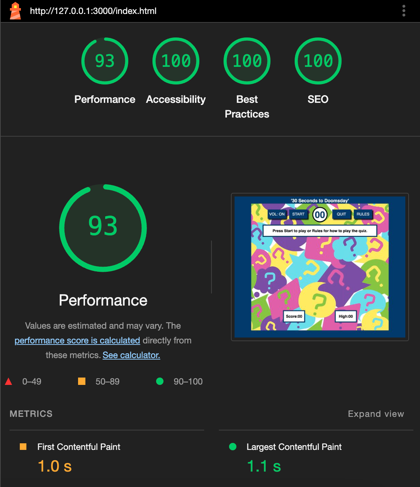
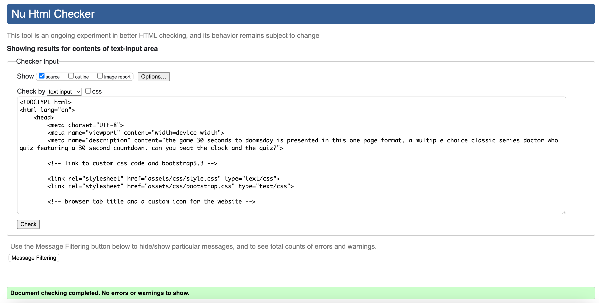
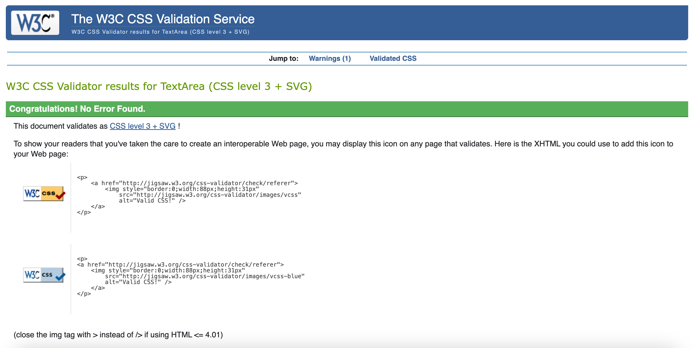

# 30 Seconds To Doomsday V1.1

** Site under construction **

This is a rewrite of my 2nd diploma project. 
The purpose of the rewrite is to see the difference between my coding then and how my coding skills have developed over time.

Looking at my original project there are several styling changes that I have made for v1.1, the buttons are now squared off and all are the same style and colour. I feel this looks better as the background used is quite brightly coloured and the buttons now stand out better. In contrast the timer is now circular rather than square making it standout from the buttons.

The background image is now surrounded by a border of 'Tardis blue' as I felt that on larger displays it isn't necessary to have the background fill the screen.

The answers are now displayed in buttons of the same style and the answers themselves can be clicked on as they are also buttons. This removes the a,b,c buttons of the original and improves the answer selection process.

The cookie notice is now in a hidden div rather than a javascript alert box.

The code has been rewritten with jQuery and Bootstrap making the code look a lot tidier. Parts of the code have been improved through more efficient coding further improving the code.

The original game can be seen here: [30 Seconds to Doomsday](thespamster.github.io/dr_who_quiz/)

## Technologies

- [Bootstrap5.3](https://getbootstrap.com/)
- [jQuery3.7.1](https://jquery.com/)

## Performance And Testing

- Google Lighthouse initial testing

- W3C HTML checker

- W3C CSS Validation

## Credits

- [iStock by Getty Images](https://www.istockphoto.com/) : Paid for question mark background image.

- [404 error jpg.](https://www.freepik.com/free-vector/oops-404-error-with-broken-robot-concept-illustration_8030430.htm#query=404&position=3&from_view=keyword&track=sph&uuid=2f72b0bf-f9e1-46f8-a48c-845f73431143") - Image by storyset on Freepik.

- [Stackoverflow](https://stackoverflow.com/) - great resource for coding questions and answers.

